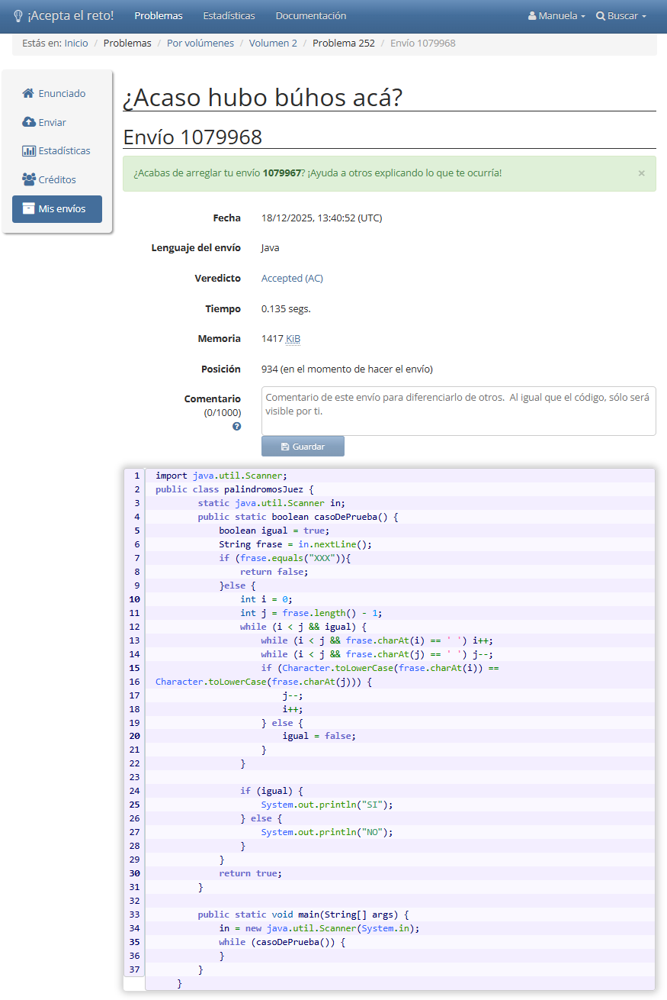
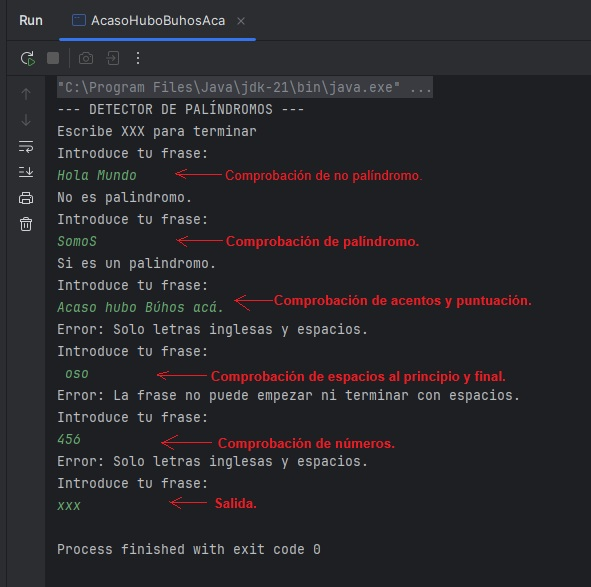
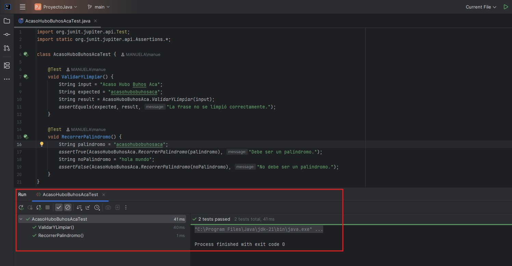
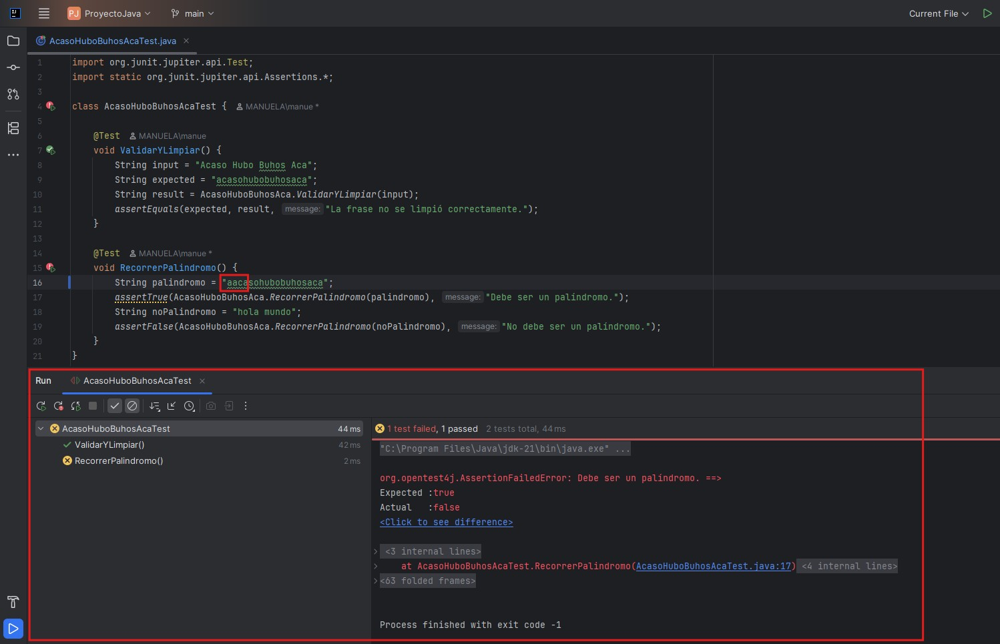
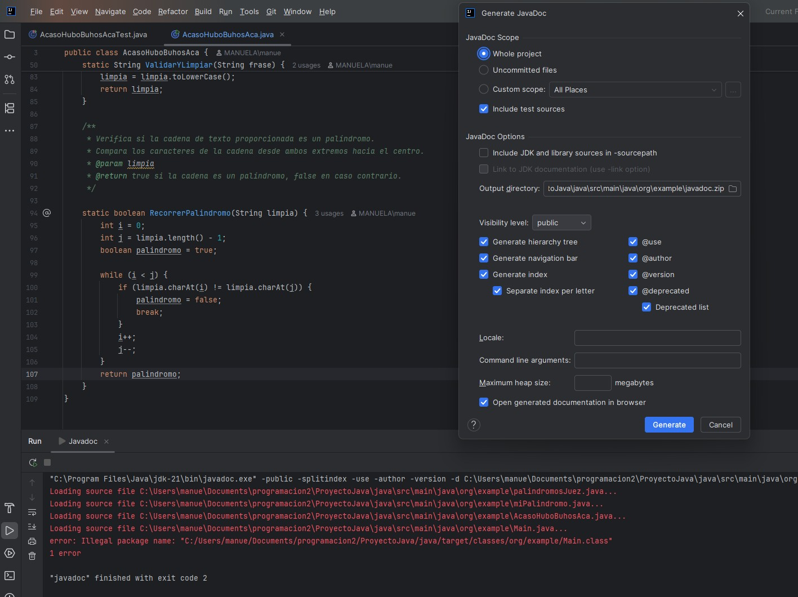

# ¿Acaso hubo búhos acá? 🦉


**Problema #252 de Acepta el Reto**

Manuela Planelles - 1º DAW - IES Mutxamel

---

## El Problema

Como indica en el enunciado del problema, un escritor argentino de 1894, se autoproclamó "recordman mundial de palindromía" con 
más de 8.000 palíndromos españoles. Aunque hoy en día ese récord lo tiene, un músico español que tiene más de 100.000 en su web.

### ¿Qué es un palíndromo?

Es una palabra o frase que se lee igual de izquierda a derecha que de derecha a izquierda, ignorando espacios, tildes y mayúsculas. 
El título del problema, "¿Acaso hubo búhos acá?", es uno de los más famosos del escritor argentino. 

Otros ejemplos:

- **somos** → se lee igual.
- **La ruta natural** → si quitas los espacios y pones todo en minúsculas (larutanatural), también funciona.
  
---

## ¿Qué se pide?

### La entrada.

El programa tiene que:
1. Cada linea puede tener hasta 100 caracteres.
2. Solo letras mayusculas o minusculas y espacios, sin signos ni tildes (alfabeti inglés).
3. No puede empezas o terminar con espacios.
4. Cuando lea "XXX" tiene que parar.

### La salida.

Para cada frase escribo:
- **SI** si es palíndromo.
- **NO** si no lo es.

---

## Cómo lo he resuelto

Mi idea ha sido dividirlo en 3 pasos:

### 1. LEER LA FRASE
```java
System.out.println("Introduce tu frase: ");
String frase = teclado.nextLine();
```

### 2. LIMPIAR Y VALIDAR.
La longitud este entre 0 y 100, que la frase no empiece ni termine con espacios, que solo se introduzcan caracteres simples (sin acentos) y espacios, comprobado quitamos los espacios y en minuscula lista para recorerla y comparar.
```java
        int longitud = frase.length();

        if (longitud == 0 || longitud > 100) {
            System.out.println("Error: La frase debe tener entre 1 y 100 caracteres.");
            return null;
        }

        if (frase.charAt(0) == ' ' || frase.charAt(longitud - 1) == ' ') {
            System.out.println("Error: La frase no puede empezar ni terminar con espacios.");
            return null;
        }

        boolean cartInv = false;
        for (int i = 0; i < longitud; i++) {
            char cart = frase.charAt(i);
            if (!((cart >= 'a' && cart <= 'z') || (cart >= 'A' && cart <= 'Z') || cart == ' ')) {
                System.out.println("Error: Solo letras inglesas y espacios.");
                cartInv = true;
                break;
            }
        }
        if (cartInv) {
            return null;
        }

        String limpia = "";
        for (int i = 0; i < frase.length(); i++) {
            char cart = frase.charAt(i);
            if (cart != ' ') {
                limpia = limpia + cart;
            }
        }
        limpia = limpia.toLowerCase();
        return limpia;
```

Por ejemplo:
```
"La ruta natural"
    ↓
"la ruta natural"  (minúsculas)
    ↓
"larutanatural"     (sin espacios)
```

### 3. INVERTIR y COMPARAR
```java
        int i = 0;
        int j = limpia.length() - 1;
        boolean palindromo = true;

        while (i < j) {
            if (limpia.charAt(i) != limpia.charAt(j)) {
                palindromo = false;
                break;
            }
            i++;
            j--;
```

Si "larutanatural" al revés es "larutanatural" → es palíndromo.

---

## El código para el juez

He seguido la plantilla oficial de Acepta el Reto (Esquema 2), la que se usa cuando hay un caso especial que marca el final.

<details>
<summary>Ver el código completo que envié al juez</summary>

```java
import java.util.Scanner;
public class palindromosJuez {
        static java.util.Scanner in;
        public static boolean casoDePrueba() {
            boolean igual = true;
            String frase = in.nextLine();
            if (frase.equals("XXX")){
                return false;
            }else {
                int i = 0;
                int j = frase.length() - 1;
                while (i < j && igual) {
                    while (i < j && frase.charAt(i) == ' ') i++;
                    while (i < j && frase.charAt(j) == ' ') j--;
                    if (Character.toLowerCase(frase.charAt(i)) == Character.toLowerCase(frase.charAt(j))) {
                        j--;
                        i++;
                    } else {
                        igual = false;
                    }
                }
                if (igual) {
                    System.out.println("SI");
                } else {
                    System.out.println("NO");
                }
            }
            return true;
        }
        public static void main(String[] args) {
            in = new java.util.Scanner(System.in);
            while (casoDePrueba()) {
            }
        }
    }
```

</details>

### El resultado

"Al principio mi código daba Presentation Error porque imprimía mensajes al usuario. Después de eliminarlos, seguía dando Wrong Answer porque tenía equalsIgnoreCase() en lugar de equals() y líneas en blanco extra. Una vez corregido, el juez lo aceptó."



```
✅ ACCEPTED.
Tiempo: 0.135 segundos.
Memoria: 1417 KiB.
Posición: 934.
```


---

## Mi versión bonita

Para el proyecto he hecho una versión más "elaborada", con lo dado en clase dividiendo el código en métodos, con JavaDoc y JUnit.
Para ello primero he generado el codigo como lo creabamos en la primera evaluacion sin metodos, y desde ahi lo he dividido por metodos.

<details>
<summary>Ver la versión con módulos y JavaDoc.</summary>

```java
import java.util.Scanner;

public class AcasoHuboBuhosAca {

    static Scanner teclado = new Scanner(System.in);

    public static void main(String[] args) {
        System.out.println("--- DETECTOR DE PALÍNDROMOS ---");
        System.out.println("Escribe XXX para terminar");

        while (true) {
            System.out.println("Introduce tu frase: ");
            String frase = teclado.nextLine();

            if (frase.equalsIgnoreCase("XXX")) {
                break;
            }

            String limpia = ValidarYLimpiar(frase); //metdo1

            if (limpia == null) {
                continue;
            }

            boolean palindromo = RecorrerPalindromo(limpia); //metodo2

            if (palindromo) {
                System.out.println("Si es un palindromo.");
            } else {
                System.out.println("No es palindromo.");
            }
        }
    }

    static String ValidarYLimpiar(String frase) {
        int longitud = frase.length();

        if (longitud == 0 || longitud > 100) {
            System.out.println("Error: La frase debe tener entre 1 y 100 caracteres.");
            return null;
        }

        if (frase.charAt(0) == ' ' || frase.charAt(longitud - 1) == ' ') {
            System.out.println("Error: La frase no puede empezar ni terminar con espacios.");
            return null;
        }

        boolean cartInv = false;
        for (int i = 0; i < longitud; i++) {
            char cart = frase.charAt(i);
            if (!((cart >= 'a' && cart <= 'z') || (cart >= 'A' && cart <= 'Z') || cart == ' ')) {
                System.out.println("Error: Solo letras inglesas y espacios.");
                cartInv = true;
                break;
            }
        }
        if (cartInv) {
            return null;
        }

        String limpia = "";
        for (int i = 0; i < frase.length(); i++) {
            char cart = frase.charAt(i);
            if (cart != ' ') {
                limpia = limpia + cart;
            }
        }
        limpia = limpia.toLowerCase();
        return limpia;
    }

    static boolean RecorrerPalindromo(String limpia) {
        int i = 0;
        int j = limpia.length() - 1;
        boolean palindromo = true;

        while (i < j) {
            if (limpia.charAt(i) != limpia.charAt(j)) {
                palindromo = false;
                break;
            }
            i++;
            j--;
        }
        return palindromo;
    }
}
```

</details>


## Las pruebas

### Pruebas manuales

He probado con varios casos, la entradas y salidas y cada una de las validaciones:



### Tests con JUnit

También he creado tests automáticos Junit. Aqui he tenido varias complicaciones, al principo no me cogia el tipo de prueba y no me aparecia el formato como los apuntes, los he escrito de forma manual, no tengo claro si es la forma correcta, pero me ha funcionado.

```java
import org.junit.jupiter.api.Test;
import static org.junit.jupiter.api.Assertions.*;

class AcasoHuboBuhosAcaTest {

    @Test
    void ValidarYLimpiar() {
        String input = "Acaso Hubo Buhos Aca";
        String expected = "acasohubobuhosaca";
        String result = AcasoHuboBuhosAca.ValidarYLimpiar(input);
        assertEquals(expected, result, "La frase no se limpió correctamente.");
    }

    @Test
    void RecorrerPalindromo() {
        String palindromo = "acasohubobuhosaca";
        assertTrue(AcasoHuboBuhosAca.RecorrerPalindromo(palindromo), "Debe ser un palíndromo.");
        String noPalindromo = "hola mundo";
        assertFalse(AcasoHuboBuhosAca.RecorrerPalindromo(noPalindromo), "No debe ser un palíndromo.");
    }
}
```

Todos los tests pasaron correctamente.

---
Tambien realice test incorrectos para comprobar el funcionamiento.

---

## Documentación

He documentado los tres métodos con Javadoc. 
En este apartado no he conseguido generar la documentación, me aparecia el siguiente error y he probado varias rutas de carpetas, y me daba el mismo error.

```java

    /**
     * Esta clase contiene los métodos necesarios para resolver el problema 252 Acaso Hubo Buho Aca - Palíndromos del Concurso ProgramaMe para el proyecto de la asignatura de programacion de 1ºDAW.
     * @author: Manuela Planelles
     * @version: 1.0 (19/12/2025)
     * @see <a href = "https://aceptaelreto.com/problem/statement.php?id=252"/> Acaso Hubo Buho Aca </a>
     */
    public static void main(String[] args) {
```
```java
    /**
     * Valída y limpia la frase proporcionada por el usuario.
     * Revisa si la frase tiene entre 1 y 100 caracteres, y si está bien formada (sin caracteres inválidos o espacios al principio o al final).
     * Elimina los espacios para facilitar la comprobación del palíndromo.
     * @param frase
     * @return La frase limpia y en minúsculas, o null si hay un error de validación.
     */
    static String ValidarYLimpiar(String frase) {
```
```java
    /**
     * Verifica si la cadena de texto proporcionada es un palíndromo.
     * Compara los caracteres de la cadena desde ambos extremos hacia el centro.
     * @param limpia
     * @return true si la cadena es un palíndromo, false en caso contrario.
     */
    static boolean RecorrerPalindromo(String limpia) {
```

---

---

### Dificultades que tuve


---

## Enlaces

- [Problema en Acepta el Reto](https://aceptaelreto.com/problem/statement.php?id=252)
- [Documentación de las plantillas](https://aceptaelreto.com/doc/templates.php)
- [Mi código en GitHub](https://github.com/manuelaplanelles/ProyectoJava.git) 

---

**Manuela Planelles**  
1º DAW - IES Mutxamel  
Diciembre 2024


